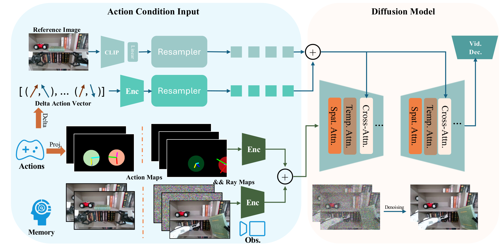

# ENERVERSE-AC: Envisioning Embodied Environments with Action Condition

<div id="top" align="center">



 <a href='https://arxiv.org/abs/2505.09723'></a> &nbsp; <a href='https://annaj2178.github.io/EnerverseAC.github.io'></a> &nbsp;  <a href='https://huggingface.co/agibot-world/EnerVerse-AC'></a> &nbsp;


</div>

This repo is the official implementation of EnerVerse-AC: Envisioning Embodied Environments with Action Condition, featuring minimal inference code to run single-view video generation.


## Getting started

The codebase was tested with Python 3.10.4, CUDA version 11.8 (higher cuda versions should work) and Pytorch version 2.4.0.

### Setup
```
git clone https://github.com/AgibotTech/EnerVerse-AC.git
conda create -n enerverse python=3.10.4
conda activate enerverse

pip install -r requirements.txt

### install pytorch3d following https://github.com/facebookresearch/pytorch3d
### note that although the CUDA version is 11.8, we use the pytorch3d prebuilt on CUDA 12.1
pip install --no-index --no-cache-dir pytorch3d -f https://dl.fbaipublicfiles.com/pytorch3d/packaging/wheels/py310_cu121_pyt240/download.html

```

### Inference

1. Download the single-view checkpoint from [EVAC](https://huggingface.co/agibot-world/EnerVerse-AC), and modify ``model.pretrained_checkpoint`` in ``configs/agibotworld/train_configs.yaml`` to the checkpoint file ``*.pt``

Note: Due to commercial restrictions on portions of the training data referenced in the paper, the released model weights were trained exclusively on the open-source [AgibotWorld dataset](https://github.com/OpenDriveLab/AgiBot-World) and do not include any failure trajectory data.

2. Download the weights of [CLIP](https://huggingface.co/laion/CLIP-ViT-H-14-laion2B-s32B-b79K) and modify ``model.params.img_cond_stage_config.params.abspath`` in ``configs/agibotworld/config.yaml`` to the absolute path to ``open_clip_pytorch_model.bin`` inside the download directory

3. Prepare necessary files, including one start frame, an action file (\*.npy or \*.h5), an extrinsic file (\*.npy or \*.json), an intrinsic file (\*.npy or \*.json). A simple conversion script from AgiBotWorld to the expected files is provided in tools/prepare_infer_data.py.

```
python tools/prepare_infer_data.py -r PATH_TO_AGIBOTWORLD_ROOT -t TASK_ID -e EPISODE_ID -s SAVE_ROOT -j JSON_OF_ACTION_INDEXES_TO_EXTRACT -c CAM_NAME
```

4. Run the script

```
python main/generate_video_acwm.py -i IMAGE_FILE -a ACTION_FILE -ex EXTRINSIC_FILE -in INTRINSIC_FILE -s SAVE_ROOT --ckp_path PATH_TO_CHECKPOINT --config_path PATH_TO_CONFIG
```

We provide processed examples in ``examples/examples*`` to clarify the usage of the script, you can run inferencing script like:
```
python main/generate_video_acwm.py -i examples/examples0/frame.png -a examples/examples0/action.npy -ex examples/examples0/extrinsics.npy -in examples/examples0/intrinsics.npy -s ./result_video_root --ckp_path PATH_TO_CHECKPOINT --config_path PATH_TO_CONFIG
```

### Train

🔥 EVAC serves as the official baseline model for the [AgiBot World Challenge@IROS 2025](https://agibot-world.com/challenge) - World Model Track. [The Challenge repository](https://github.com/AgibotTech/AgiBotWorldChallengeIROS2025-WorldModelBaseline) provides a minimal version of the training code for reference. Feel free to train the model and explore its capabilities!

🔥 Don't miss the [AgiBot World Challenge@IROS 2025](https://agibot-world.com/challenge) - come be part of it!


### Related Works
This project draws inspiration from the following projects:
- [EnerVerse](https://sites.google.com/view/enerverse)
- [DynamiCrafter](https://github.com/Doubiiu/DynamiCrafter)
- [LVDM](https://github.com/YingqingHe/LVDM)


### Citation
Please consider citing our paper if our codes are useful:
```bib
@article{jiang2025enerverseac,
  title={EnerVerse-AC: Envisioning Embodied Environments with Action Condition},
  author={Jiang, Yuxin and Chen, Shengcong and Huang, Siyuan and Chen, Liliang and Zhou, Pengfei and Liao, Yue and He, Xindong and Liu, Chiming and Li, Hongsheng and Yao, Maoqing and Ren, Guanghui},
  journal={arXiv preprint arXiv:2505.09723},
  year={2025}
}
@article{huang2025enerverse,
  title={Enerverse: Envisioning embodied future space for robotics manipulation},
  author={Huang, Siyuan and Chen, Liliang and Zhou, Pengfei and Chen, Shengcong and Jiang, Zhengkai and Hu, Yue and Liao, Yue and Gao, Peng and Li, Hongsheng and Yao, Maoqing and others},
  journal={arXiv preprint arXiv:2501.01895},
  year={2025}
}
```


## License
All the data and code within this repo are under [CC BY-NC-SA 4.0](https://creativecommons.org/licenses/by-nc-sa/4.0/).
